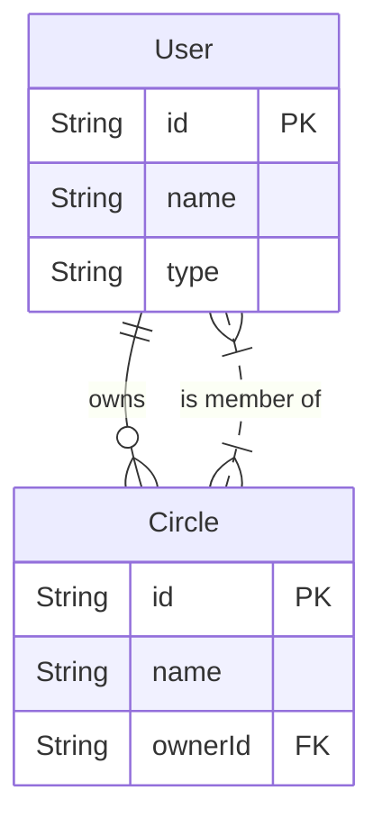

# ER Diagram

```mermaid
erDiagram
    User ||--o{ Circle : "owns"
    User }|..|{ Circle : "is member of"

    User {
        String id PK
        String name
        String type
    }

    Circle {
        String id PK
        String name
        String ownerId FK
    }
```
