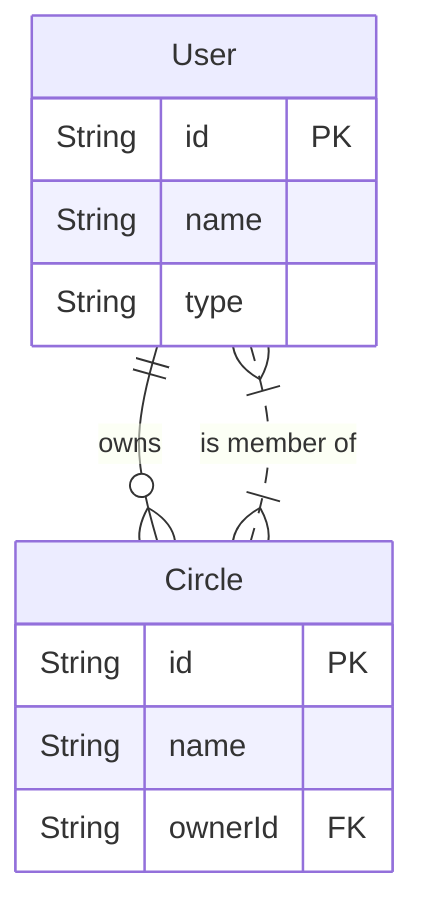
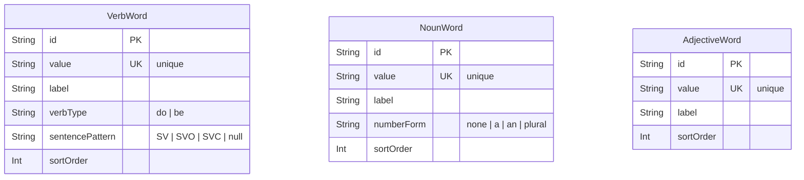

# ER Diagram

## User & Circle

## Word Tables (Practice Mode)

## Notes

- **VerbWord**: 動詞データ（Do動詞とBe動詞）
- **NounWord**: 名詞データ（目的語・補語として使用）
- **AdjectiveWord**: 形容詞データ（Be動詞の補語として使用）
- これらのテーブルは独立しており、リレーションはありません
