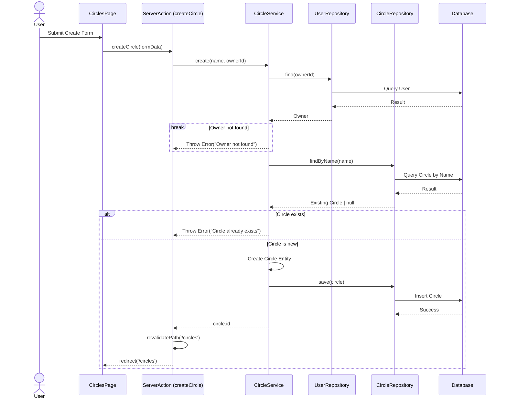

# Create Circle Sequence

```mermaid
sequenceDiagram
    actor User
    participant Page as CirclesPage
    participant Action as ServerAction (createCircle)
    participant Service as CircleService
    participant UserRepo as UserRepository
    participant CircleRepo as CircleRepository
    participant DB as Database

    User->>Page: Submit Create Form
    Page->>Action: createCircle(formData)
    Action->>Service: create(name, ownerId)

    Service->>UserRepo: find(ownerId)
    UserRepo->>DB: Query User
    DB-->>UserRepo: Result
    UserRepo-->>Service: Owner

    break Owner not found
        Service-->>Action: Throw Error("Owner not found")
    end

    Service->>CircleRepo: findByName(name)
    CircleRepo->>DB: Query Circle by Name
    DB-->>CircleRepo: Result
    CircleRepo-->>Service: Existing Circle | null

    alt Circle exists
        Service-->>Action: Throw Error("Circle already exists")
    else Circle is new
        Service->>Service: Create Circle Entity
        Service->>CircleRepo: save(circle)
        CircleRepo->>DB: Insert Circle
        DB-->>CircleRepo: Success
        Service-->>Action: circle.id
        Action->>Action: revalidatePath('/circles')
        Action-->>Page: redirect('/circles')
    end
```
