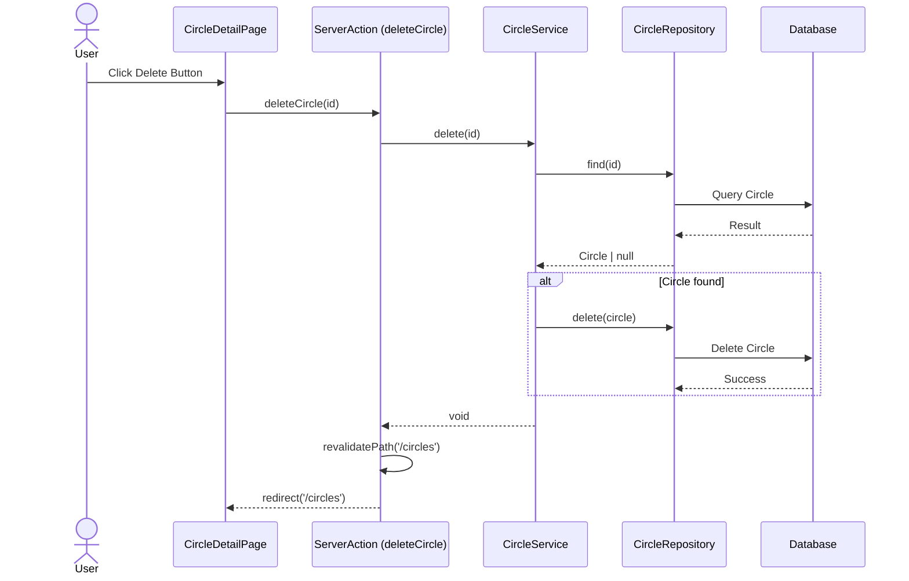

# Delete Circle Sequence

```mermaid
sequenceDiagram
    actor User
    participant Page as CircleDetailPage
    participant Action as ServerAction (deleteCircle)
    participant Service as CircleService
    participant CircleRepo as CircleRepository
    participant DB as Database

    User->>Page: Click Delete Button
    Page->>Action: deleteCircle(id)
    Action->>Service: delete(id)

    Service->>CircleRepo: find(id)
    CircleRepo->>DB: Query Circle
    DB-->>CircleRepo: Result
    CircleRepo-->>Service: Circle | null

    alt Circle found
        Service->>CircleRepo: delete(circle)
        CircleRepo->>DB: Delete Circle
        DB-->>CircleRepo: Success
    end

    Service-->>Action: void
    Action->>Action: revalidatePath('/circles')
    Action-->>Page: redirect('/circles')
```
