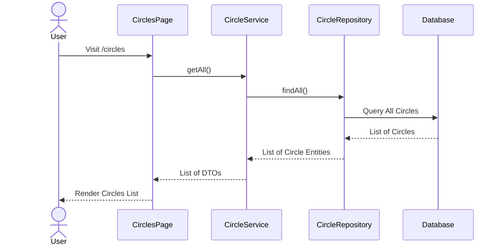

# Get All Circles Sequence

```mermaid
sequenceDiagram
    actor User
    participant Page as CirclesPage
    participant Service as CircleService
    participant CircleRepo as CircleRepository
    participant DB as Database

    User->>Page: Visit /circles
    Page->>Service: getAll()
    Service->>CircleRepo: findAll()
    CircleRepo->>DB: Query All Circles
    DB-->>CircleRepo: List of Circles
    CircleRepo-->>Service: List of Circle Entities
    Service-->>Page: List of DTOs
    Page-->>User: Render Circles List
```
