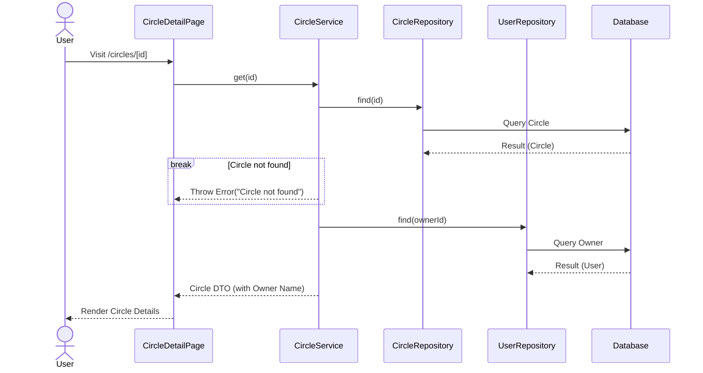

# Get Circle Sequence

```mermaid
sequenceDiagram
    actor User
    participant Page as CircleDetailPage
    participant Service as CircleService
    participant CircleRepo as CircleRepository
    participant UserRepo as UserRepository
    participant DB as Database

    User->>Page: Visit /circles/[id]
    Page->>Service: get(id)
    Service->>CircleRepo: find(id)
    CircleRepo->>DB: Query Circle
    DB-->>CircleRepo: Result (Circle)
    
    break Circle not found
        Service-->>Page: Throw Error("Circle not found")
    end

    Service->>UserRepo: find(ownerId)
    UserRepo->>DB: Query Owner
    DB-->>UserRepo: Result (User)
    
    Service-->>Page: Circle DTO (with Owner Name)
    Page-->>User: Render Circle Details
```
