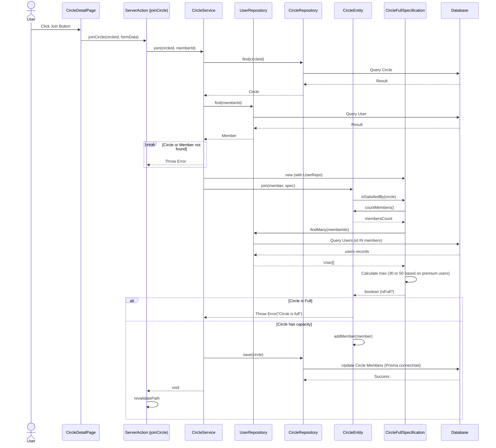

# Join Circle Sequence

```mermaid
sequenceDiagram
    actor User
    participant Page as CircleDetailPage
    participant Action as ServerAction (joinCircle)
    participant Service as CircleService
    participant UserRepo as UserRepository
    participant CircleRepo as CircleRepository
    participant Domain as CircleEntity
    participant Spec as CircleFullSpecification
    participant DB as Database

    User->>Page: Click Join Button
    Page->>Action: joinCircle(circleId, formData)
    Action->>Service: join(circleId, memberId)

    Service->>CircleRepo: find(circleId)
    CircleRepo->>DB: Query Circle
    DB-->>CircleRepo: Result
    CircleRepo-->>Service: Circle

    Service->>UserRepo: find(memberId)
    UserRepo->>DB: Query User
    DB-->>UserRepo: Result
    UserRepo-->>Service: Member

    break Circle or Member not found
        Service-->>Action: Throw Error
    end

    Service->>Spec: new (with UserRepo)
    Service->>Domain: join(member, spec)
    
    Domain->>Spec: isSatisfiedBy(circle)
    Spec->>Domain: countMembers()
    Domain-->>Spec: membersCount
    Spec->>UserRepo: findMany(memberIds)
    UserRepo->>DB: Query Users (id IN members)
    DB-->>UserRepo: users records
    UserRepo-->>Spec: User[]
    Spec->>Spec: Calculate max (30 or 50 based on premium users)
    Spec-->>Domain: boolean (isFull?)

    alt Circle is Full
        Domain-->>Service: Throw Error("Circle is full")
    else Circle has capacity
        Domain->>Domain: addMember(member)
        Service->>CircleRepo: save(circle)
        CircleRepo->>DB: Update Circle Members (Prisma connect/set)
        DB-->>CircleRepo: Success
        Service-->>Action: void
        Action->>Action: revalidatePath
    end
```
