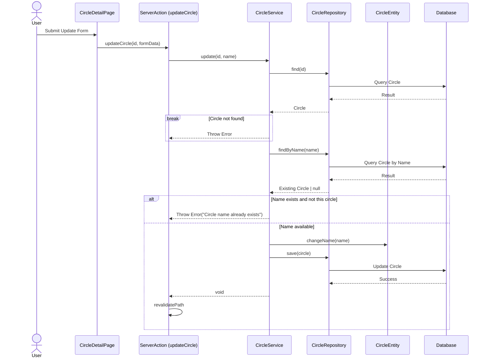

# Update Circle Sequence

```mermaid
sequenceDiagram
    actor User
    participant Page as CircleDetailPage
    participant Action as ServerAction (updateCircle)
    participant Service as CircleService
    participant CircleRepo as CircleRepository
    participant Domain as CircleEntity
    participant DB as Database

    User->>Page: Submit Update Form
    Page->>Action: updateCircle(id, formData)
    Action->>Service: update(id, name)

    Service->>CircleRepo: find(id)
    CircleRepo->>DB: Query Circle
    DB-->>CircleRepo: Result
    CircleRepo-->>Service: Circle

    break Circle not found
        Service-->>Action: Throw Error
    end

    Service->>CircleRepo: findByName(name)
    CircleRepo->>DB: Query Circle by Name
    DB-->>CircleRepo: Result
    CircleRepo-->>Service: Existing Circle | null

    alt Name exists and not this circle
        Service-->>Action: Throw Error("Circle name already exists")
    else Name available
        Service->>Domain: changeName(name)
        Service->>CircleRepo: save(circle)
        CircleRepo->>DB: Update Circle
        DB-->>CircleRepo: Success
        Service-->>Action: void
        Action->>Action: revalidatePath
    end
```
