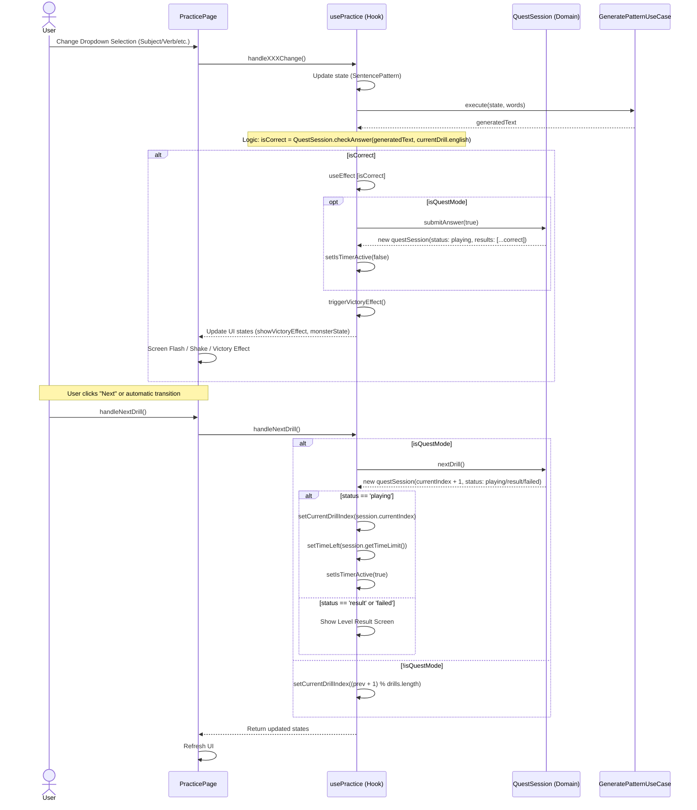

# Practice Answer Verification Sequence

```mermaid
sequenceDiagram
    actor User
    participant Page as PracticePage
    participant Hook as usePractice (Hook)
    participant Session as QuestSession (Domain)
    participant UC as GeneratePatternUseCase

    User->>Page: Change Dropdown Selection (Subject/Verb/etc.)
    Page->>Hook: handleXXXChange()
    Hook->>Hook: Update state (SentencePattern)
    
    Hook->>UC: execute(state, words)
    UC-->>Hook: generatedText

    Note over Hook: Logic: isCorrect = QuestSession.checkAnswer(generatedText, currentDrill.english)

    alt isCorrect
        Hook->>Hook: useEffect [isCorrect]
        
        opt isQuestMode
            Hook->>Session: submitAnswer(true)
            Session-->>Hook: new questSession(status: playing, results: [...correct])
            Hook->>Hook: setIsTimerActive(false)
        end

        Hook->>Hook: triggerVictoryEffect()
        Hook-->>Page: Update UI states (showVictoryEffect, monsterState)
        Page->>Page: Screen Flash / Shake / Victory Effect
    end

    Note over User, Page: User clicks "Next" or automatic transition

    User->>Page: handleNextDrill()
    Page->>Hook: handleNextDrill()
    
    alt isQuestMode
        Hook->>Session: nextDrill()
        Session-->>Hook: new questSession(currentIndex + 1, status: playing/result/failed)
        
        alt status == 'playing'
            Hook->>Hook: setCurrentDrillIndex(session.currentIndex)
            Hook->>Hook: setTimeLeft(session.getTimeLimit())
            Hook->>Hook: setIsTimerActive(true)
        else status == 'result' or 'failed'
            Hook->>Hook: Show Level Result Screen
        end
    else !isQuestMode
        Hook->>Hook: setCurrentDrillIndex((prev + 1) % drills.length)
    end

    Hook-->>Page: Return updated states
    Page->>Page: Refresh UI
```
