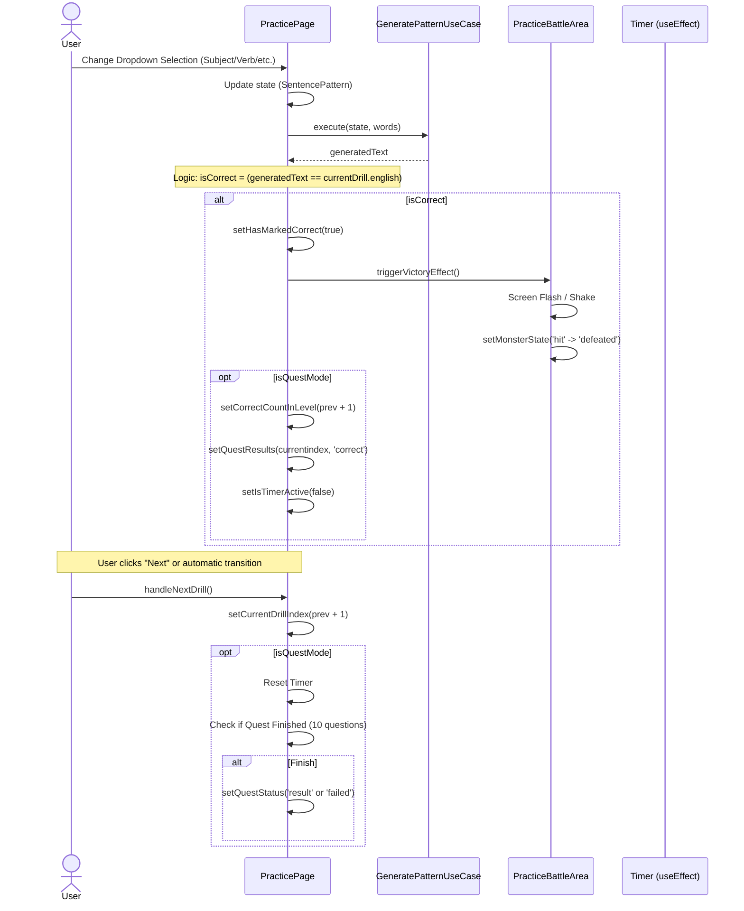

# Practice Answer Verification Sequence

```mermaid
sequenceDiagram
    actor User
    participant Page as PracticePage
    participant UC as GeneratePatternUseCase
    participant Battle as PracticeBattleArea
    participant Timer as Timer (useEffect)

    User->>Page: Change Dropdown Selection (Subject/Verb/etc.)
    Page->>Page: Update state (SentencePattern)
    
    Page->>UC: execute(state, words)
    UC-->>Page: generatedText

    Note over Page: Logic: isCorrect = (generatedText == currentDrill.english)

    alt isCorrect
        Page->>Page: setHasMarkedCorrect(true)
        Page->>Battle: triggerVictoryEffect()
        Battle->>Battle: Screen Flash / Shake
        Battle->>Battle: setMonsterState('hit' -> 'defeated')
        
        opt isQuestMode
            Page->>Page: setCorrectCountInLevel(prev + 1)
            Page->>Page: setQuestResults(currentindex, 'correct')
            Page->>Page: setIsTimerActive(false)
        end
    end

    Note over User, Page: User clicks "Next" or automatic transition

    User->>Page: handleNextDrill()
    Page->>Page: setCurrentDrillIndex(prev + 1)
    
    opt isQuestMode
        Page->>Page: Reset Timer
        Page->>Page: Check if Quest Finished (10 questions)
        alt Finish
            Page->>Page: setQuestStatus('result' or 'failed')
        end
    end
```
