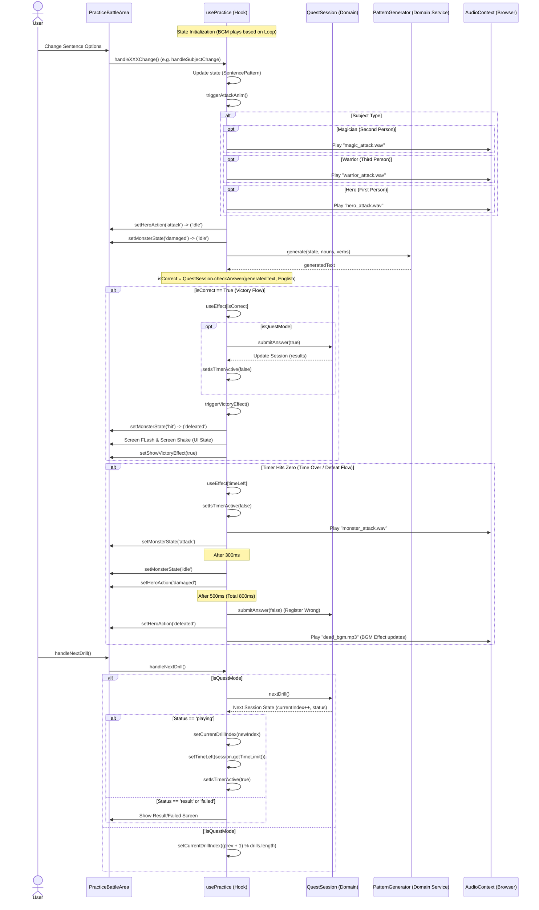

# Practice Answer Verification Sequence

```mermaid
sequenceDiagram
    actor User
    participant Page as PracticeBattleArea
    participant Hook as usePractice (Hook)
    participant Session as QuestSession (Domain)
    participant Gen as PatternGenerator (Domain Service)
    participant Audio as AudioContext (Browser)

    Note over Hook: State Initialization (BGM plays based on Loop)

    User->>Page: Change Sentence Options
    Page->>Hook: handleXXXChange() (e.g. handleSubjectChange)
    Hook->>Hook: Update state (SentencePattern)
    
    Hook->>Hook: triggerAttackAnim()
    alt Subject Type
        opt Magician (Second Person)
            Hook->>Audio: Play "magic_attack.wav"
        end
        opt Warrior (Third Person)
            Hook->>Audio: Play "warrior_attack.wav"
        end
        opt Hero (First Person)
            Hook->>Audio: Play "hero_attack.wav"
        end
    end
    Hook->>Page: setHeroAction('attack') -> ('idle')
    Hook->>Page: setMonsterState('damaged') -> ('idle')
    
    Hook->>Gen: generate(state, nouns, verbs)
    Gen-->>Hook: generatedText

    Note over Hook: isCorrect = QuestSession.checkAnswer(generatedText, English)

    alt isCorrect == True (Victory Flow)
        Hook->>Hook: useEffect[isCorrect]
        
        opt isQuestMode
            Hook->>Session: submitAnswer(true)
            Session-->>Hook: Update Session (results)
            Hook->>Hook: setIsTimerActive(false)
        end

        Hook->>Hook: triggerVictoryEffect()
        Hook->>Page: setMonsterState('hit') -> ('defeated')
        Hook->>Page: Screen FLash & Screen Shake (UI State)
        Hook->>Page: setShowVictoryEffect(true)
    end

    alt Timer Hits Zero (Time Over / Defeat Flow)
        Hook->>Hook: useEffect[timeLeft]
        Hook->>Hook: setIsTimerActive(false)
        Hook->>Audio: Play "monster_attack.wav"
        Hook->>Page: setMonsterState('attack')
        
        Note over Hook: After 300ms
        Hook->>Page: setMonsterState('idle')
        Hook->>Page: setHeroAction('damaged')
        
        Note over Hook: After 500ms (Total 800ms)
        Hook->>Session: submitAnswer(false) (Register Wrong)
        Hook->>Page: setHeroAction('defeated')
        Hook->>Audio: Play "dead_bgm.mp3" (BGM Effect updates)
    end

    User->>Page: handleNextDrill()
    Page->>Hook: handleNextDrill()
    
    alt isQuestMode
        Hook->>Session: nextDrill()
        Session-->>Hook: Next Session State (currentIndex++, status)
        
        alt Status == 'playing'
            Hook->>Hook: setCurrentDrillIndex(newIndex)
            Hook->>Hook: setTimeLeft(session.getTimeLimit())
            Hook->>Hook: setIsTimerActive(true)
        else Status == 'result' or 'failed'
            Hook->>Page: Show Result/Failed Screen
        end
    else !isQuestMode
        Hook->>Hook: setCurrentDrillIndex((prev + 1) % drills.length)
    end
```
