# Practice Answer Verification Sequence

## シーケンス図

```mermaid
sequenceDiagram
    actor User
    participant Audio as Audio (Browser API)
    participant Page as PracticeBattleArea
    participant Hook as usePractice (Hook)
    participant Session as QuestSession (Domain Entity)
    participant Gen as PatternGenerator (Domain Service)

    Note over Hook: 初期化済: BGM再生中, Timer作動中(QuestMode)

    User->>Page: 文法設定を変更 (主語, 動詞など)
    Page->>Hook: handleSubjectChange / handleVerbChange etc.
    Hook->>Hook: setState(newPattern)
    
    rect rgb(20, 20, 20)
        Note right of Hook: 攻撃アニメーション & 効果音
        Hook->>Hook: triggerAttackAnim()
        alt Subject is Second Person (Mage)
            Hook->>Audio: Play "magic_attack.wav"
        else Subject is Third Person (Warrior)
            Hook->>Audio: Play "warrior_attack.wav"
        else Subject is First Person (Hero)
            Hook->>Audio: Play "hero_attack.wav"
        end
        Hook->>Page: setHeroAction('attack') -> setMonsterState('damaged')
    end

    Hook->>Gen: generate(state, nouns, verbs)
    Gen-->>Hook: generatedText (英文作成)
    Hook->>Hook: setGeneratedText

    Note right of Hook: 正誤判定プロセス
    Hook->>Session: checkAnswer(generatedText, currentDrill.english)
    Session-->>Hook: isCorrect (boolean)
    
    Hook-->>Page: isCorrect渡す
    
    alt isCorrect == True (正解時)
        Hook->>Hook: useEffect[isCorrect]
        
        opt QuestMode & Status is Playing
            Hook->>Session: submitAnswer(true)
            Session-->>Hook: Update Session (results更新)
            Hook->>Hook: setIsTimerActive(false)
            Hook->>Hook: setHasMarkedCorrect(true)
        end

        Hook->>Hook: triggerVictoryEffect()
        Hook->>Page: setIsScreenFlashing(true)
        Hook->>Page: setIsScreenShaking(true)
        Hook->>Page: setMonsterState('hit') -> ('defeated')
        Hook->>Page: setShowVictoryEffect(true)
    end

    alt Timer Hits Zero (時間切れ/敗北時)
        Hook->>Hook: useEffect[timeLeft]
        Hook->>Hook: setIsTimerActive(false)
        Hook->>Audio: Play "monster_attack.wav"
        Hook->>Page: setMonsterState('attack')
        
        Note right of Hook: ダメージ演出シーケンス
        Hook->>Page: setHeroAction('damaged')
        
        Note right of Hook: 敗北確定 (500ms後)
        Hook->>Session: submitAnswer(false) (不正解として登録)
        Hook->>Page: setHeroAction('defeated')
        Hook->>Audio: Play "dead_bgm.mp3" (BGM切替)
    end

    opt Next Drill (handleNextDrill)
        User->>Page: クリック "次の問題へ"
        Page->>Hook: handleNextDrill()
        
        alt QuestMode
            Hook->>Session: nextDrill()
            Session-->>Hook: newSession
            alt Status is Playing
                Hook->>Hook: setCurrentDrillIndex()
                Hook->>Hook: setTimeLeft()
            else Status is Result/Failed
                Hook->>Page: 結果画面表示
            end
        else FreeMode
            Hook->>Hook: Cycle Index
        end
    end
```

## 詳細説明

このシーケンス図は、練習モードにおける「解答の検証」から「結果のフィードバック（正解演出または時間切れ）」までの一連の流れを示しています。

### 1. ユーザーの入力とリアルタイム判定
ユーザーが画面上の文法オプション（主語や動詞など）を変更すると、即座に英文が再生成されます（`PatternGenerator`）。
この生成された英文は、システムが保持している正解データ（`currentDrill.english`）と常に照合されています（`checkAnswer`）。ユーザーが送信ボタンを押すのではなく、正しい英文が構築された瞬間に「正解」とみなされるリアルタイム判定方式です。

### 2. 正解時のフロー (Victory Flow)
判定が `True` になると、`useEffect` が反応して正解処理が走ります。
*   **クエストモード:** セッション状態を更新し（`submitAnswer(true)`）、タイマーを停止させます。
*   **演出:** 画面のフラッシュ、シェイク、モンスターの撃破アニメーション（`hit` -> `defeated`）を順次実行し、プレイヤーに爽快感を与えます。

### 3. 時間切れ時のフロー (Time Over / Defeat Flow)
タイマーが0になると、自動的に「敗北」シーケンスに入ります。
1.  **モンスターの攻撃:** 攻撃音とともにモンスターが攻撃モーションをとります。
2.  **ダメージと敗北:** プレイヤーキャラクターがダメージを受け、その後倒れます（`defeated`）。同時にBGMが「dead_bgm.mp3」に切り替わります。
3.  **結果確定:** クエストセッションには「不正解」として記録されます。

### 4. 次の問題へ
正解後、ユーザーが「次の問題へ」進むと、`handleNextDrill` が呼ばれ、`QuestSession` は次のドリルへと状態を遷移させます。全問終了時や規定の失敗数に達した場合は、結果画面（Result/Failed）へと表示が切り替わります。
