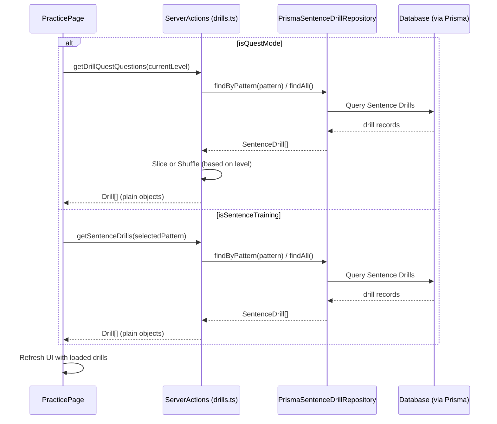

# Fetch Drills Sequence

```mermaid
sequenceDiagram
    participant Page as PracticePage
    participant Action as ServerActions (drills.ts)
    participant Repo as PrismaSentenceDrillRepository
    participant DB as Database (via Prisma)

    alt isQuestMode
        Page->>Action: getDrillQuestQuestions(currentLevel)
        Action->>Repo: findByPattern(pattern) / findAll()
        Repo->>DB: Query Sentence Drills
        DB-->>Repo: drill records
        Repo-->>Action: SentenceDrill[]
        Action->>Action: Slice or Shuffle (based on level)
        Action-->>Page: Drill[] (plain objects)
    else isSentenceTraining
        Page->>Action: getSentenceDrills(selectedPattern)
        Action->>Repo: findByPattern(pattern) / findAll()
        Repo->>DB: Query Sentence Drills
        DB-->>Repo: drill records
        Repo-->>Action: SentenceDrill[]
        Action-->>Page: Drill[] (plain objects)
    end

    Page->>Page: Refresh UI with loaded drills
```
