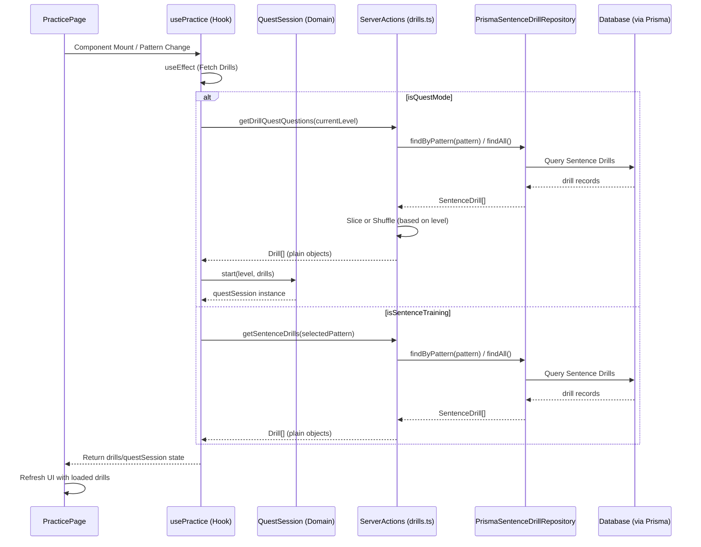

# Fetch Drills Sequence

```mermaid
sequenceDiagram
    participant Page as PracticePage
    participant Hook as usePractice (Hook)
    participant Session as QuestSession (Domain)
    participant Action as ServerActions (drills.ts)
    participant Repo as PrismaSentenceDrillRepository
    participant DB as Database (via Prisma)

    Page->>Hook: Component Mount / Pattern Change
    Hook->>Hook: useEffect (Fetch Drills)

    alt isQuestMode
        Hook->>Action: getDrillQuestQuestions(currentLevel)
        Action->>Repo: findByPattern(pattern) / findAll()
        Repo->>DB: Query Sentence Drills
        DB-->>Repo: drill records
        Repo-->>Action: SentenceDrill[]
        Action->>Action: Slice or Shuffle (based on level)
        Action-->>Hook: Drill[] (plain objects)
        
        Hook->>Session: start(level, drills)
        Session-->>Hook: questSession instance
    else isSentenceTraining
        Hook->>Action: getSentenceDrills(selectedPattern)
        Action->>Repo: findByPattern(pattern) / findAll()
        Repo->>DB: Query Sentence Drills
        DB-->>Repo: drill records
        Repo-->>Action: SentenceDrill[]
        Action-->>Hook: Drill[] (plain objects)
    end

    Hook-->>Page: Return drills/questSession state
    Page->>Page: Refresh UI with loaded drills
```
