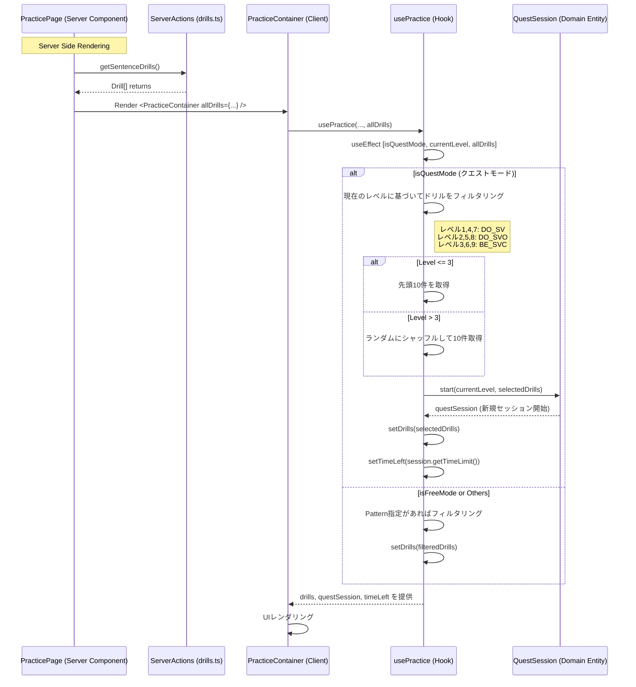

# Fetch Drills Sequence

## シーケンス図

## 詳細説明

このシーケンス図は、練習問題（Drill）のデータ取得から、それがクライアントサイドでどのように初期処理され、プレイ可能な状態になるかを示しています。

### 1. データ取得 (Server Side)

Next.jsのApp Routerを使用しているため、`PracticePage`（サーバーコンポーネント）でデータの取得が行われます。
`getSentenceDrills` アクションを通じて、データベースや定数ファイルから全ての問題データを取得し、それを `PracticeContainer` クライアントコンポーネントにプロップスとして渡します。

### 2. 初期化とフィルタリング (Client Side)

`PracticeContainer` は受け取ったドリルデータを `usePractice` フックに渡します。
フック内では、現在のモード（クエストモードかトレーニングモードか）とプレイヤーのレベルに応じて、適切な問題セットを構築します。

- **クエストモード:**
  - レベルに応じた文法パターン（SV, SVO, SVCなど）でフィルタリングします。
  - レベルが上がると、ランダムな出題になるロジックが含まれています（Level > 3）。
  - `QuestSession.start` を呼び出し、ゲームセッション（正解数管理や進行管理を行うオブジェクト）を作成します。
- **フリーモード:**
  - ユーザーが指定したパターン、あるいは全件表示など、自由な設定でリストを作成します。

### 3. セッション開始

クエストモードの場合、フィルタリングされた10問を用いてセッションが開始され、残り時間（TimeLimit）もレベルに応じて設定されます。これにより、ユーザーは即座にプレイを開始できます。
