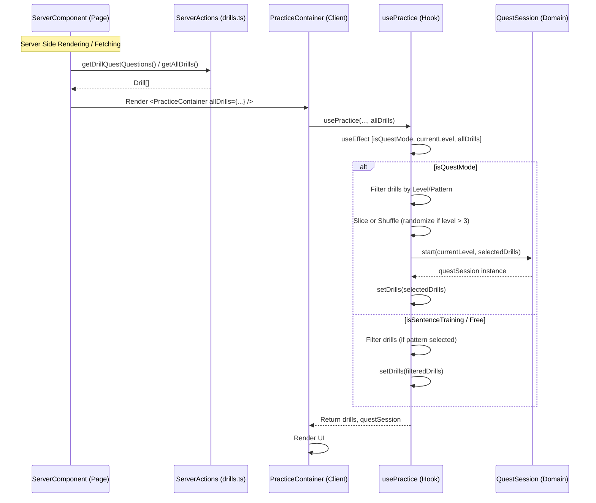

# Fetch Drills Sequence

```mermaid
sequenceDiagram
    participant Parent as ServerComponent (Page)
    participant Action as ServerActions (drills.ts)
    participant Page as PracticeContainer (Client)
    participant Hook as usePractice (Hook)
    participant Session as QuestSession (Domain)

    Note over Parent: Server Side Rendering / Fetching
    
    Parent->>Action: getDrillQuestQuestions() / getAllDrills()
    Action-->>Parent: Drill[]

    Parent->>Page: Render <PracticeContainer allDrills={...} />
    Page->>Hook: usePractice(..., allDrills)
    
    Hook->>Hook: useEffect [isQuestMode, currentLevel, allDrills]

    alt isQuestMode
        Hook->>Hook: Filter drills by Level/Pattern
        Hook->>Hook: Slice or Shuffle (randomize if level > 3)
        Hook->>Session: start(currentLevel, selectedDrills)
        Session-->>Hook: questSession instance
        Hook->>Hook: setDrills(selectedDrills)
    else isSentenceTraining / Free
        Hook->>Hook: Filter drills (if pattern selected)
        Hook->>Hook: setDrills(filteredDrills)
    end

    Hook-->>Page: Return drills, questSession
    Page->>Page: Render UI
```
