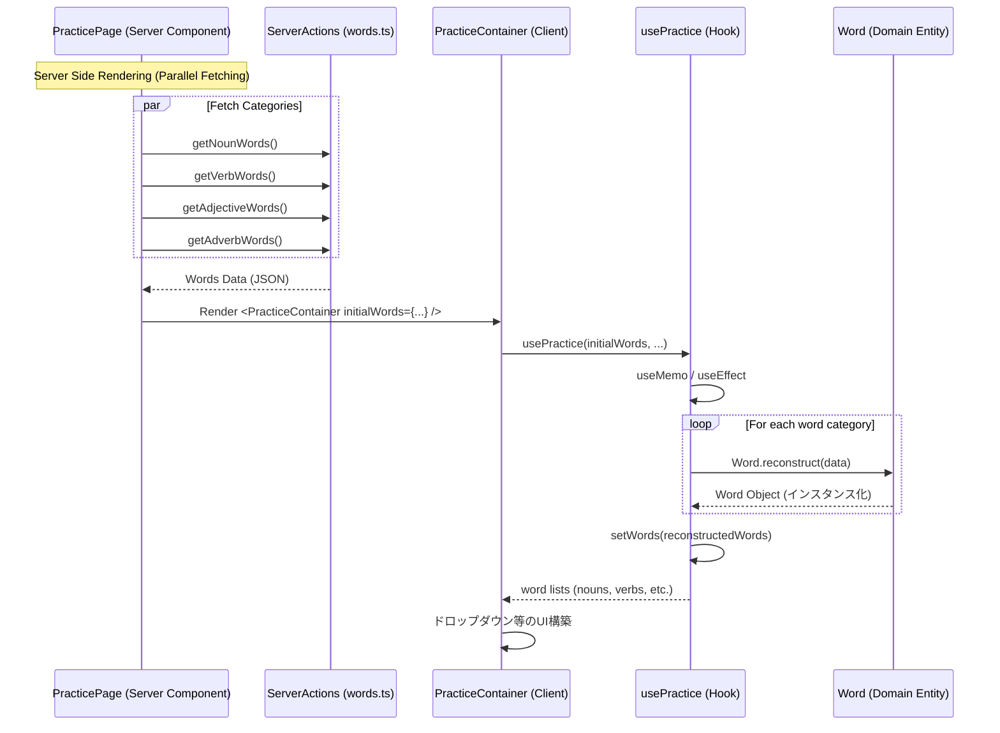

# Fetch Initial Word Data Sequence

## シーケンス図

## 詳細説明

このシーケンス図は、練習に必要な単語データ（名詞、動詞、形容詞、副詞）の取得と初期化フローを示しています。

### 1. サーバーサイドでの一括取得

`PracticePage` ロード時に、必要な全単語データをサーバーアクション経由で取得します。これらは `Promise.all` のように並列で（あるいは順次waitして）取得され、一つの `initialWords` オブジェクトにまとめられます。

### 2. ドメインオブジェクトへの再構築 (Reconstruction)

サーバーから渡されるデータはプレーンなJSONオブジェクト（DTO）です。
クライアントサイドの `usePractice` フックにおいて、これらをドメインロジックを持つ `Word` クラスのインスタンスとして再構築（`reconstruct`）します。
これにより、単語ごとの特殊な振る舞い（複数形の生成ルールや、動詞の活用形メソッドなど）が利用可能になります。

### 3. 状態への反映

再構築された単語リストは `words` ステートとして保持され、UIコンポーネント（ `PracticeAnswerArea` 内のドロップダウンなど）に供給されます。これにより、ユーザーは動詞や名詞を選択して英文を作成できるようになります。
