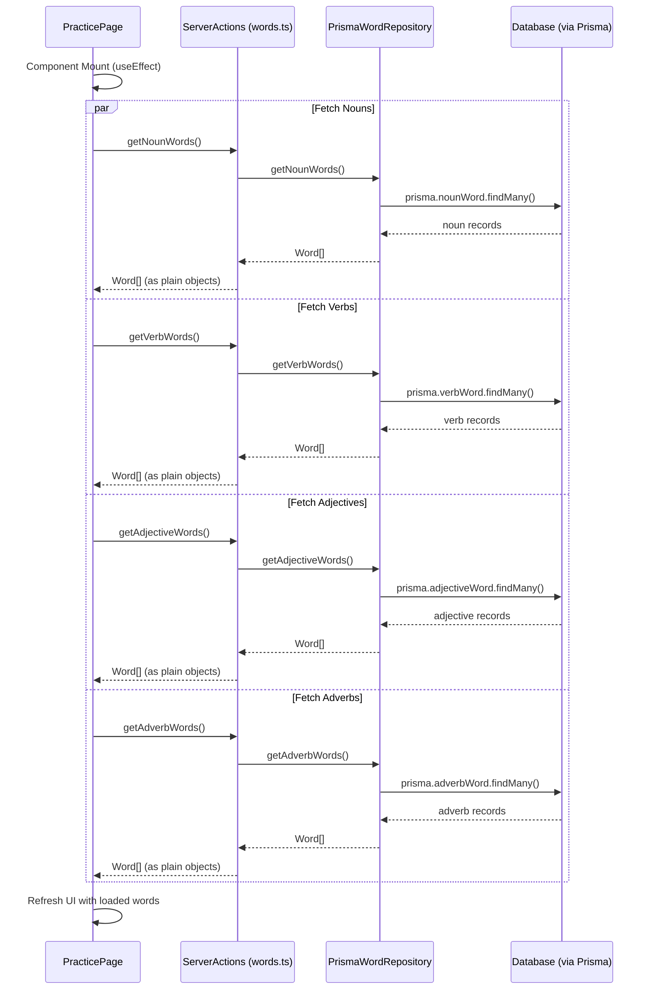

# Fetch Initial Word Data Sequence

```mermaid
sequenceDiagram
    participant Page as PracticePage
    participant Action as ServerActions (words.ts)
    participant Repo as PrismaWordRepository
    participant DB as Database (via Prisma)

    Page->>Page: Component Mount (useEffect)
    
    par Fetch Nouns
        Page->>Action: getNounWords()
        Action->>Repo: getNounWords()
        Repo->>DB: prisma.nounWord.findMany()
        DB-->>Repo: noun records
        Repo-->>Action: Word[]
        Action-->>Page: Word[] (as plain objects)
    and Fetch Verbs
        Page->>Action: getVerbWords()
        Action->>Repo: getVerbWords()
        Repo->>DB: prisma.verbWord.findMany()
        DB-->>Repo: verb records
        Repo-->>Action: Word[]
        Action-->>Page: Word[] (as plain objects)
    and Fetch Adjectives
        Page->>Action: getAdjectiveWords()
        Action->>Repo: getAdjectiveWords()
        Repo->>DB: prisma.adjectiveWord.findMany()
        DB-->>Repo: adjective records
        Repo-->>Action: Word[]
        Action-->>Page: Word[] (as plain objects)
    and Fetch Adverbs
        Page->>Action: getAdverbWords()
        Action->>Repo: getAdverbWords()
        Repo->>DB: prisma.adverbWord.findMany()
        DB-->>Repo: adverb records
        Repo-->>Action: Word[]
        Action-->>Page: Word[] (as plain objects)
    end

    Page->>Page: Refresh UI with loaded words
```
