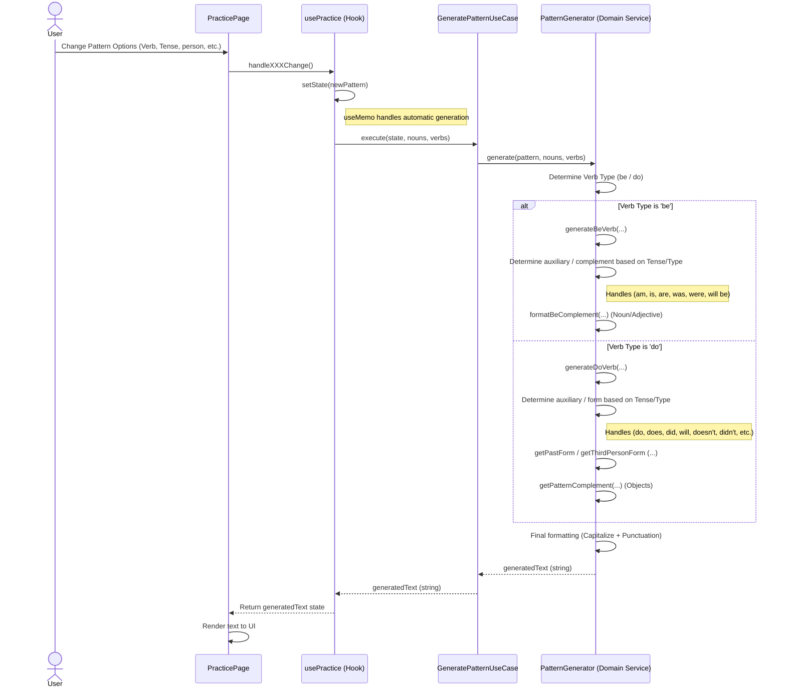

# Generate Pattern Sequence

```mermaid
sequenceDiagram
    actor User
    participant Page as PracticePage
    participant Hook as usePractice (Hook)
    participant UseCase as GeneratePatternUseCase
    participant Service as PatternGenerator (Domain Service)

    User->>Page: Change Pattern Options (Verb, Tense, person, etc.)
    Page->>Hook: handleXXXChange()
    Hook->>Hook: setState(newPattern)
    
    Note right of Hook: useMemo handles automatic generation
    
    Hook->>UseCase: execute(state, nouns, verbs)
    UseCase->>Service: generate(pattern, nouns, verbs)
    
    Service->>Service: Determine Verb Type (be / do)
    
    alt Verb Type is 'be'
        Service->>Service: generateBeVerb(...)
        Service->>Service: Determine auxiliary / complement based on Tense/Type
        Note right of Service: Handles (am, is, are, was, were, will be)
        Service->>Service: formatBeComplement(...) (Noun/Adjective)
    else Verb Type is 'do'
        Service->>Service: generateDoVerb(...)
        Service->>Service: Determine auxiliary / form based on Tense/Type
        Note right of Service: Handles (do, does, did, will, doesn't, didn't, etc.)
        Service->>Service: getPastForm / getThirdPersonForm (...)
        Service->>Service: getPatternComplement(...) (Objects)
    end
    
    Service->>Service: Final formatting (Capitalize + Punctuation)
    Service-->>UseCase: generatedText (string)
    UseCase-->>Hook: generatedText (string)
    
    Hook-->>Page: Return generatedText state
    Page->>Page: Render text to UI
```
