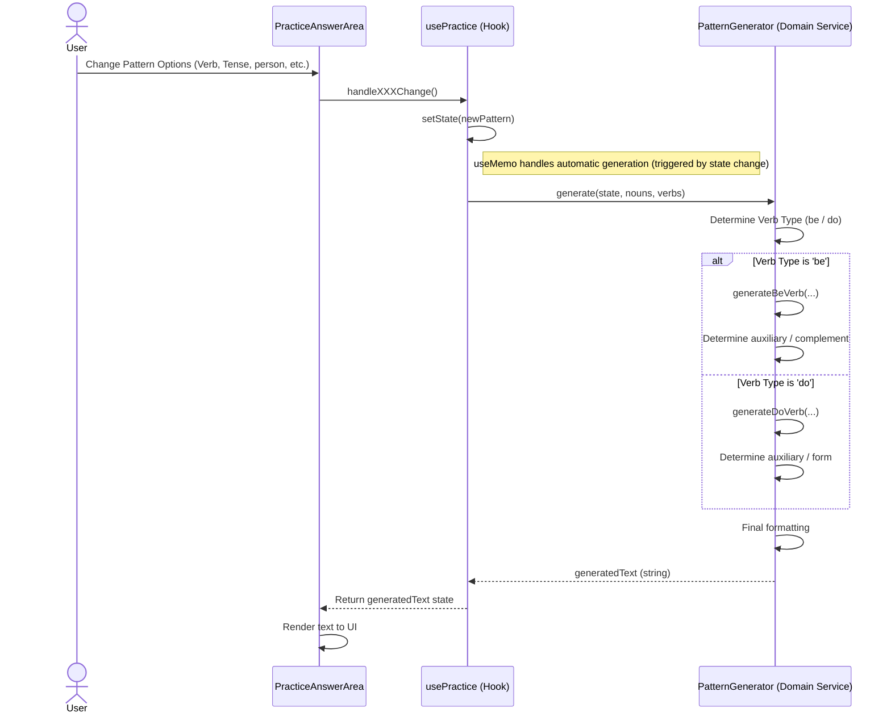

# Generate Pattern Sequence

```mermaid
sequenceDiagram
    actor User
    participant Page as PracticeAnswerArea
    participant Hook as usePractice (Hook)
    participant Service as PatternGenerator (Domain Service)

    User->>Page: Change Pattern Options (Verb, Tense, person, etc.)
    Page->>Hook: handleXXXChange()
    Hook->>Hook: setState(newPattern)
    
    Note right of Hook: useMemo handles automatic generation (triggered by state change)
    
    Hook->>Service: generate(state, nouns, verbs)
    
    Service->>Service: Determine Verb Type (be / do)
    
    alt Verb Type is 'be'
        Service->>Service: generateBeVerb(...)
        Service->>Service: Determine auxiliary / complement
    else Verb Type is 'do'
        Service->>Service: generateDoVerb(...)
        Service->>Service: Determine auxiliary / form
    end
    
    Service->>Service: Final formatting
    Service-->>Hook: generatedText (string)
    
    Hook-->>Page: Return generatedText state
    Page->>Page: Render text to UI
```
