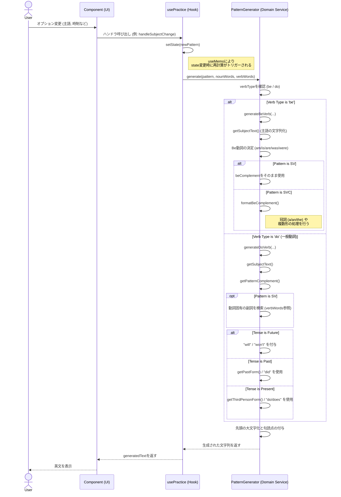

# Generate Pattern Sequence

## シーケンス図

## 詳細説明

このシーケンス図は、ユーザーが練習画面（Practice画面）で設定を変更した際に、どのように英文が動的に生成されるかを示しています。

### 1. ユーザー操作と状態管理 (UI layer & Hook layer)

ユーザーが画面上のタブやドロップダウン（主語、時制、肯定/否定など）を操作すると、各UIコンポーネントは`usePractice`フックのハンドラ関数（`handleSubjectChange`など）を呼び出します。
フック内では`useState`によって管理されている`SentencePattern`オブジェクト（主語、動詞、時制などの設定値の集合）が更新されます。

### 2. 反応的な生成プロセス (Reactive Generation)

`usePractice`フック内では、`useMemo`を使用して`state`（設定値）や辞書データ（`nounWords`, `verbWords`）の変更を監視しています。これらのいずれかが変更されると、即座にドメインサービスである`PatternGenerator.generate`メソッドが呼び出され、新しい英文が生成されます。

### 3. ドメインロジック (Domain Service layer)

`PatternGenerator`は、英語の文法ルールをカプセル化したクラスです。
生成プロセスは大きく分けて「be動詞」と「一般動詞(do)」の2つのルートに分岐します。

- **be動詞の場合 (`generateBeVerb`):**
  - 主語と時制に基づいて、適切なbe動詞（am, is, are, was, were）を決定します。
  - 文型（SV, SVC）に応じて補語の処理を行います。特にSVC文型で補語が名詞の場合、`formatBeComplement`メソッドが呼ばれ、単数・複数や冠詞（a/an/the）の適切な付与が行われます。

- **一般動詞の場合 (`generateDoVerb`):**
  - 時制（現在、過去、未来）と文の種類（肯定、否定、疑問）に応じて、助動詞（do, does, did, will）の使用や、動詞の活用形（三単現のs、過去形edなど）を決定します。
  - 動詞の不規則変化や、特殊な複数形などは、渡された辞書データ（`verbWords`）を参照して解決します。
  - SV文型の場合、動詞に関連付いた副詞（Adverb）があればそれを補います。

### 4. 最終整形

最後に、生成された文字列の先頭を大文字にし、文の種類に応じてピリオド（.）またはクエスチョンマーク（?）を付与して、完成した英文を返します。これがUIに反映されます。
