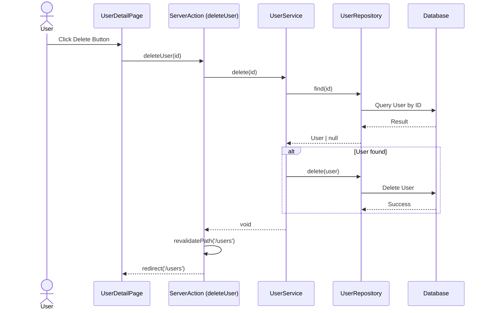

# Delete User Sequence

```mermaid
sequenceDiagram
    actor User
    participant Page as UserDetailPage
    participant Action as ServerAction (deleteUser)
    participant Service as UserService
    participant Repo as UserRepository
    participant DB as Database

    User->>Page: Click Delete Button
    Page->>Action: deleteUser(id)
    Action->>Service: delete(id)
    
    Service->>Repo: find(id)
    Repo->>DB: Query User by ID
    DB-->>Repo: Result
    Repo-->>Service: User | null
    
    alt User found
        Service->>Repo: delete(user)
        Repo->>DB: Delete User
        DB-->>Repo: Success
    end
    
    Service-->>Action: void
    Action->>Action: revalidatePath('/users')
    Action-->>Page: redirect('/users')
```
