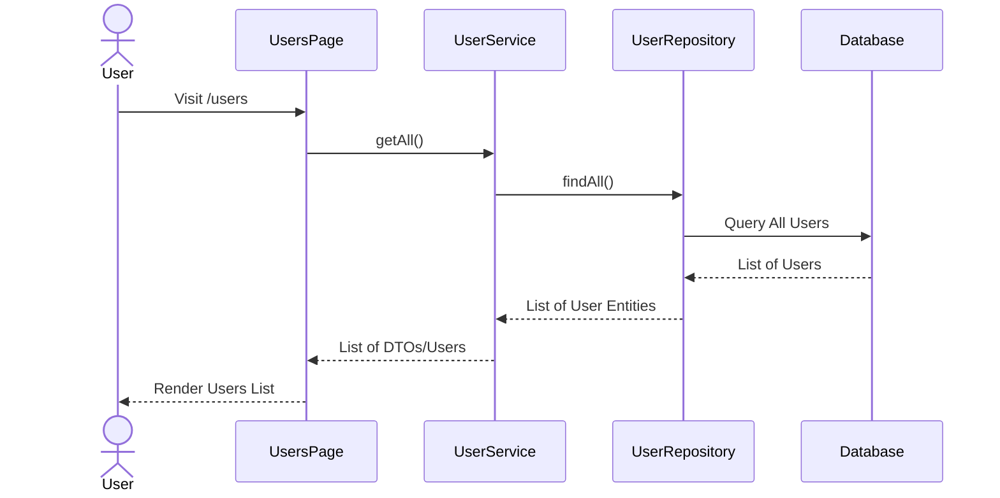

# List Users Sequence

```mermaid
sequenceDiagram
    actor User
    participant Page as UsersPage
    participant Service as UserService
    participant Repo as UserRepository
    participant DB as Database

    User->>Page: Visit /users
    Page->>Service: getAll()
    Service->>Repo: findAll()
    Repo->>DB: Query All Users
    DB-->>Repo: List of Users
    Repo-->>Service: List of User Entities
    Service-->>Page: List of DTOs/Users
    Page-->>User: Render Users List
```
