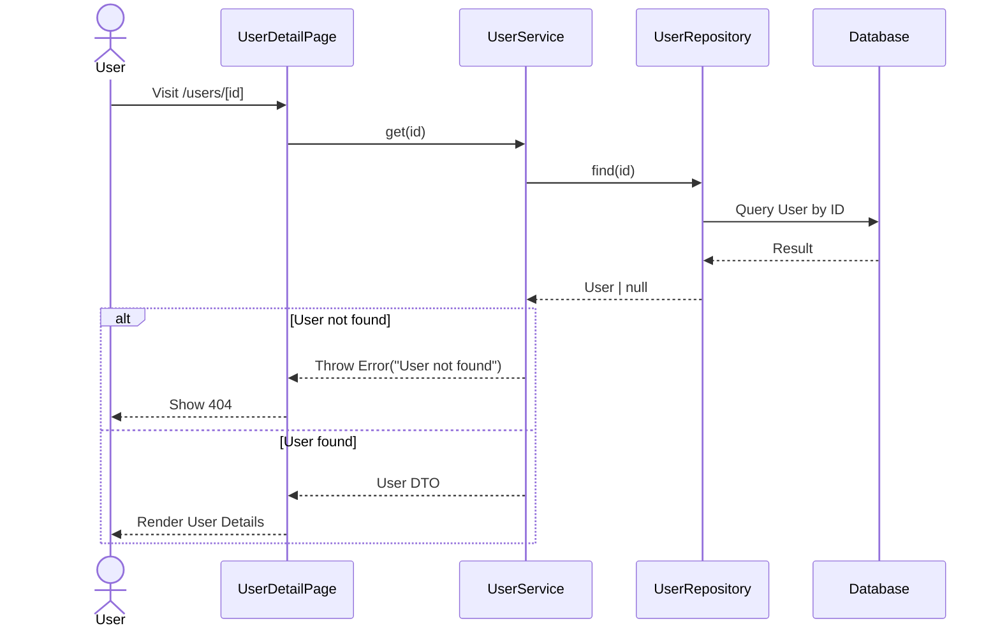

# Get User Detail Sequence

```mermaid
sequenceDiagram
    actor User
    participant Page as UserDetailPage
    participant Service as UserService
    participant Repo as UserRepository
    participant DB as Database

    User->>Page: Visit /users/[id]
    Page->>Service: get(id)
    Service->>Repo: find(id)
    Repo->>DB: Query User by ID
    DB-->>Repo: Result
    Repo-->>Service: User | null

    alt User not found
        Service-->>Page: Throw Error("User not found")
        Page-->>User: Show 404
    else User found
        Service-->>Page: User DTO
        Page-->>User: Render User Details
    end
```
