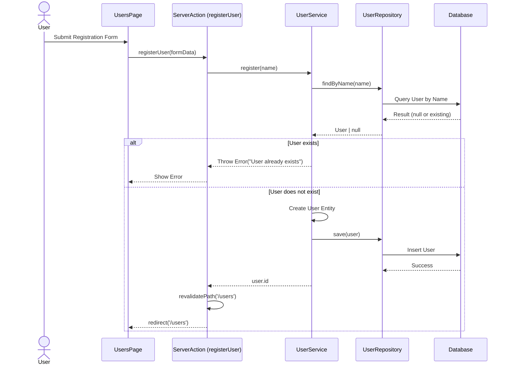

# User Registration Sequence

```mermaid
sequenceDiagram
    actor User
    participant Page as UsersPage
    participant Action as ServerAction (registerUser)
    participant Service as UserService
    participant Repo as UserRepository
    participant DB as Database

    User->>Page: Submit Registration Form
    Page->>Action: registerUser(formData)
    Action->>Service: register(name)
    Service->>Repo: findByName(name)
    Repo->>DB: Query User by Name
    DB-->>Repo: Result (null or existing)
    Repo-->>Service: User | null
    
    alt User exists
        Service-->>Action: Throw Error("User already exists")
        Action-->>Page: Show Error
    else User does not exist
        Service->>Service: Create User Entity
        Service->>Repo: save(user)
        Repo->>DB: Insert User
        DB-->>Repo: Success
        Service-->>Action: user.id
        Action->>Action: revalidatePath('/users')
        Action-->>Page: redirect('/users')
    end
```
