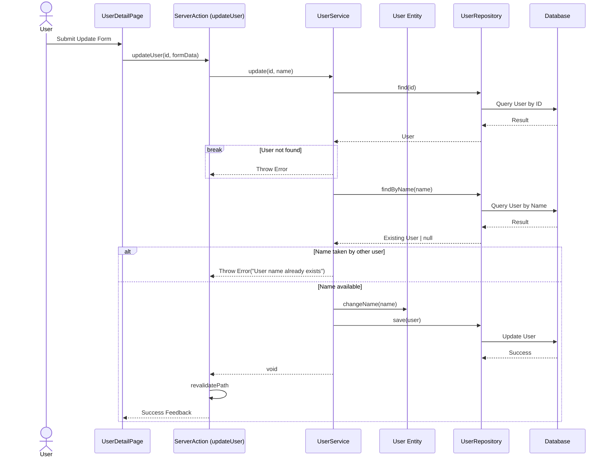

# Update User Sequence

```mermaid
sequenceDiagram
    actor User
    participant Page as UserDetailPage
    participant Action as ServerAction (updateUser)
    participant Service as UserService
    participant Domain as User Entity
    participant Repo as UserRepository
    participant DB as Database

    User->>Page: Submit Update Form
    Page->>Action: updateUser(id, formData)
    Action->>Service: update(id, name)
    
    Service->>Repo: find(id)
    Repo->>DB: Query User by ID
    DB-->>Repo: Result
    Repo-->>Service: User
    
    break User not found
        Service-->>Action: Throw Error
    end

    Service->>Repo: findByName(name)
    Repo->>DB: Query User by Name
    DB-->>Repo: Result
    Repo-->>Service: Existing User | null
    
    alt Name taken by other user
        Service-->>Action: Throw Error("User name already exists")
    else Name available
        Service->>Domain: changeName(name)
        Service->>Repo: save(user)
        Repo->>DB: Update User
        DB-->>Repo: Success
        Service-->>Action: void
        Action->>Action: revalidatePath
        Action-->>Page: Success Feedback
    end
```
